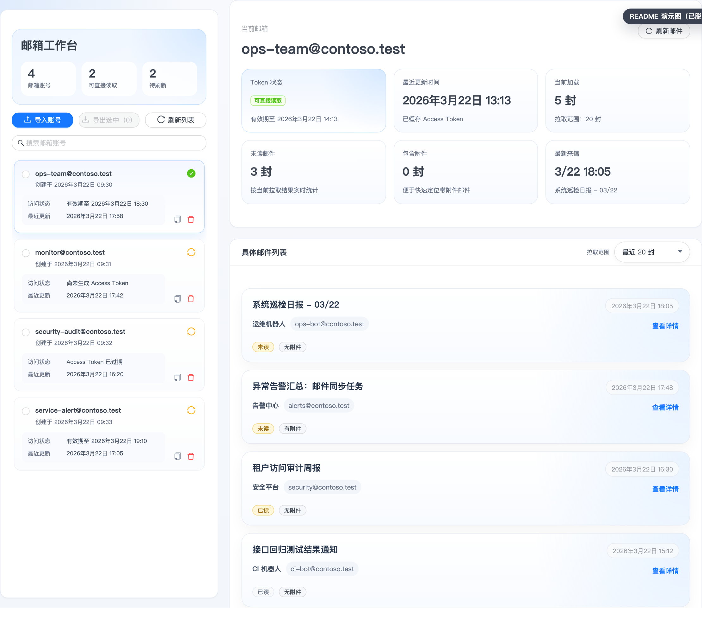
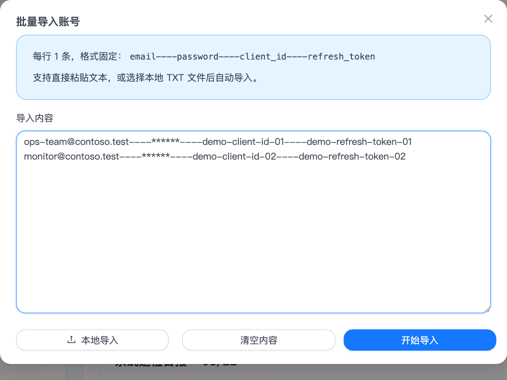
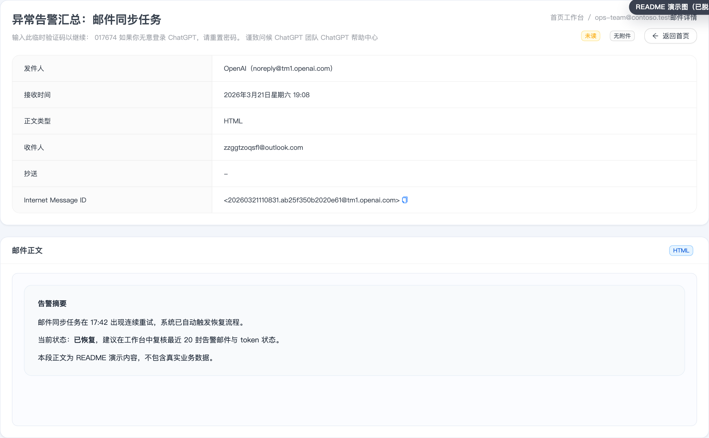

# MSMail

一个基于 `Nuxt 4 + Nitro + Prisma + SQLite` 的微软邮箱账号管理与邮件查询工作台。

它面向“**已拿到微软邮箱账号授权信息**”的场景，帮助你集中管理账号、查看最近邮件、打开邮件详情，并通过带 `x-api-key` 的接口对外提供只读查询能力。

> [!IMPORTANT]
> 当前版本**不负责 OAuth 授权申请流程**，也**不提供发信能力**。
> 使用前请自行准备已具备 `offline_access` 与 `Mail.Read` 权限的 `client_id` 和 `refresh_token`。

## 功能概览

- 批量导入邮箱账号，支持文本粘贴和本地 TXT 文件导入
- 搜索、勾选导出、删除本地账号配置
- 自动缓存并刷新 Microsoft Graph `access_token`
- 展示账号可读状态、最近更新时间、已读未读等概览信息
- 查看指定邮箱最近邮件列表
- 查看邮件详情，支持 HTML / 纯文本正文展示
- 提供带 `x-api-key` 鉴权的对外查询接口，便于其他系统按邮箱读取邮件

导入格式固定为每行一条：

```txt
email----password----client_id----refresh_token
```

## 产品截图

> [!NOTE]
> 以下截图均为 README 演示图，已做脱敏处理，不包含真实邮箱、真实 token 或真实邮件正文。

### 工作台首页



### 批量导入



### 邮件详情



## 技术栈

- 前端：Nuxt 4、Vue 3、TypeScript、Ant Design Vue
- 服务端：Nitro Server API
- 数据访问：Prisma
- 默认数据库：SQLite
- 参数校验：Zod
- 内容安全：DOMPurify

## 快速开始

### 1. 安装依赖

```bash
npm install
```

### 2. 配置环境变量

```bash
cp .env.example .env
```

默认环境变量如下：

```env
DATABASE_URL="file:./data/mailbox.db"
APP_API_KEY="please-change-me"
MS_TOKEN_ENDPOINT="https://login.microsoftonline.com/common/oauth2/v2.0/token"
MS_GRAPH_SCOPE="offline_access Mail.Read"
```

说明：

- `DATABASE_URL` 默认对应仓库中的 `prisma/data/mailbox.db`
- `APP_API_KEY` 用于保护对外查询接口，开源部署时务必替换
- `MS_TOKEN_ENDPOINT` 默认为微软公共租户 token 地址；如你使用自定义租户，可按需覆盖
- `MS_GRAPH_SCOPE` 默认要求 `offline_access Mail.Read`

### 3. 初始化数据库

```bash
npm run db:push
```

### 4. 启动开发环境

```bash
npm run dev
```

默认访问地址：

```txt
http://localhost:3000
```

## 常用命令

```bash
# 类型检查
npm run check

# 生成 Prisma Client
npm run prisma:generate

# 同步 Prisma Schema 到数据库
npm run db:push

# 生产构建
npm run build

# 本地预览生产构建
npm run preview
```

## 生产部署

适合当前仓库现状的最小部署流程如下：

```bash
npm install
cp .env.example .env
npm run db:push
npm run build
node .output/server/index.mjs
```

部署建议：

- 修改 `.env` 中的 `APP_API_KEY`，不要使用默认值
- 默认使用 SQLite，适合单机部署；如需多实例或更高并发，建议改造数据库方案后再扩展
- 持久化 `prisma/data/` 目录，避免容器或机器重建后数据丢失
- 对公网提供服务时，建议通过 Nginx、Caddy 或其他反向代理接入 HTTPS
- 如需进程守护，可自行接入 `PM2`、`systemd` 等工具

## 对外接口

所有接口均返回统一结构：

```json
{
  "success": true,
  "code": "OK",
  "message": "ok",
  "data": {}
}
```

### 1. 获取指定邮箱最近邮件

```bash
curl "http://localhost:3000/api/external/emails?email=ops-team@contoso.test&limit=20" \
  -H "x-api-key: your-app-api-key"
```

参数说明：

- `email`：目标邮箱地址
- `limit`：返回数量，范围 `1 ~ 100`，默认 `20`

### 2. 获取邮件详情

```bash
curl "http://localhost:3000/api/external/emails/detail?email=ops-team@contoso.test&messageId=message-id-from-list-api" \
  -H "x-api-key: your-app-api-key"
```

参数说明：

- `email`：目标邮箱地址
- `messageId`：来自列表接口返回结果中的邮件 `id`

## 安全说明

- 仓库中不要提交真实 `.env`、真实数据库文件或真实导入文本
- 导入数据包含邮箱密码、`client_id`、`refresh_token`，请仅在受控环境中使用
- 开源展示时，建议统一使用脱敏截图、演示账号和演示接口参数
- 对外接口虽然已支持 `x-api-key` 鉴权，但仍建议配合 IP 白名单、网关或反向代理进行进一步保护

## 适用场景

- 管理一批已经完成授权的 Microsoft 邮箱账号
- 作为内部邮件查看工作台，快速定位最近来信
- 为其他系统提供简单的“按邮箱读取邮件”能力
- 用作微软邮箱抓取、只读查询、轻量管理后台的基础模板
