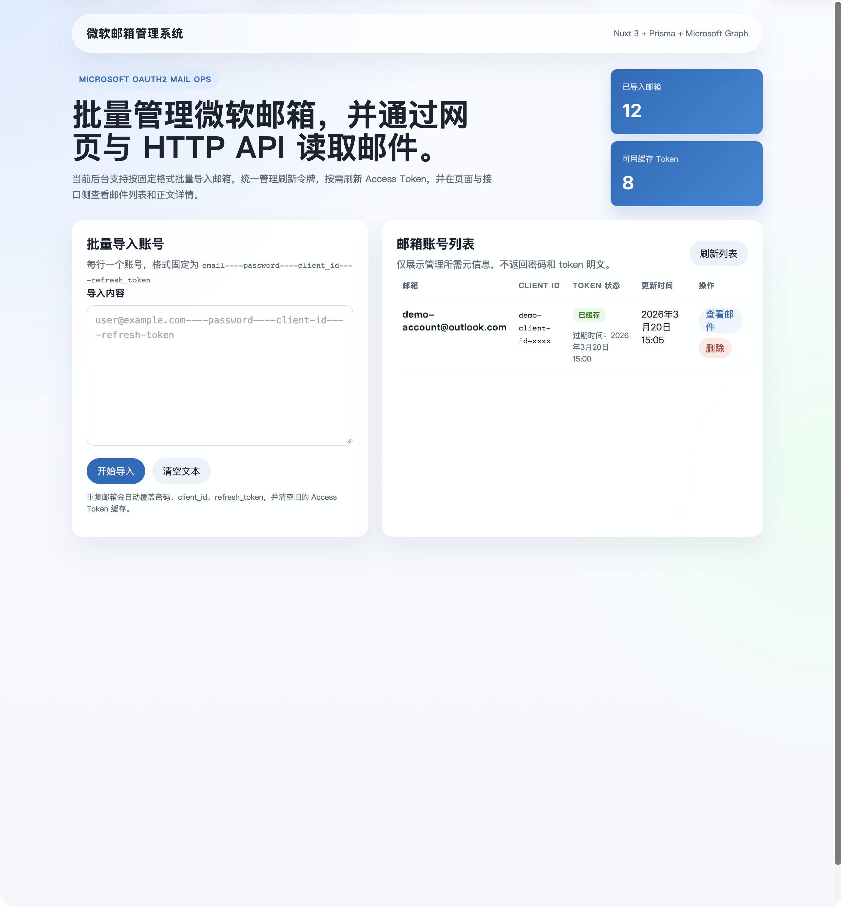
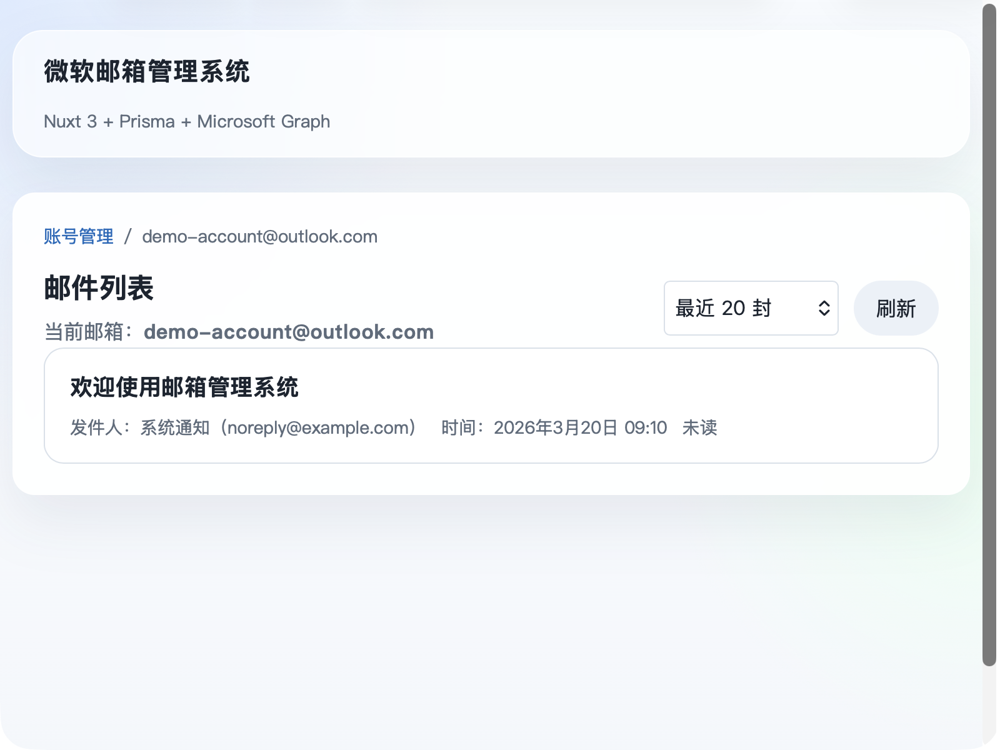
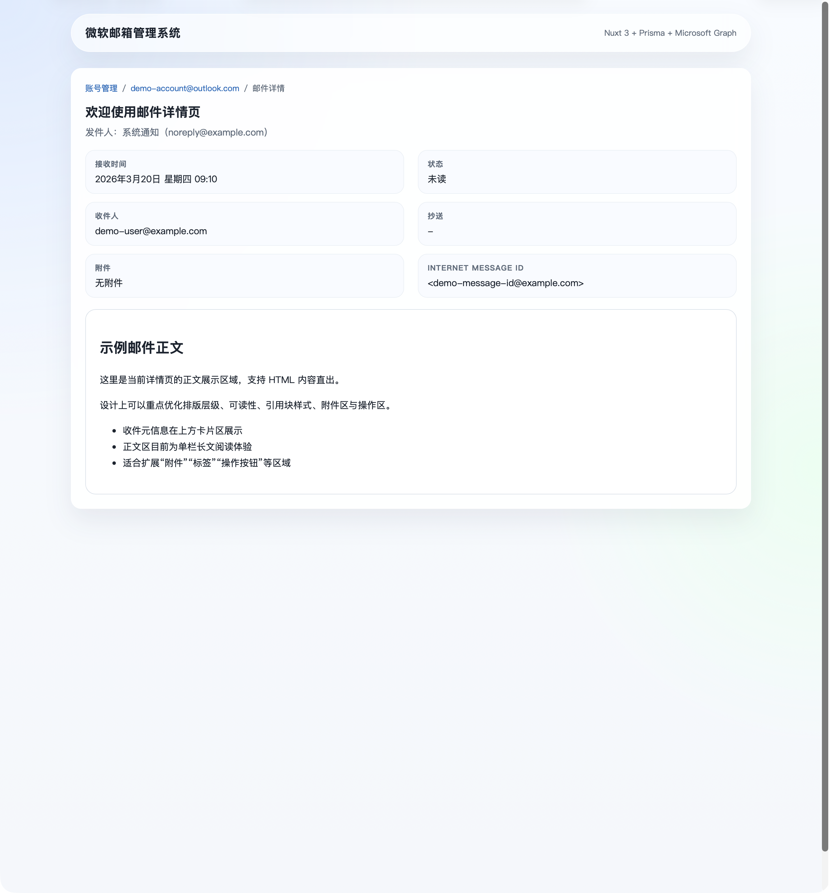

# 微软邮箱管理系统 设计交接说明

## 1. 项目定位

这是一个面向内部使用的微软邮箱管理后台，核心目标是：

- 批量导入并管理多个微软邮箱账号
- 在网页中查看指定邮箱的邮件列表与邮件详情
- 对外提供 HTTP API，供其他系统读取邮件列表和邮件正文

当前系统没有后台登录页，进入站点后默认就是管理首页。

---

## 2. 现有功能清单

当前已经可用的能力如下：

- 批量导入邮箱账号
  - 导入格式为：`email----password----client_id----refresh_token`
  - 支持多行导入
  - 相同邮箱重复导入时会覆盖更新

- 邮箱账号管理
  - 展示已导入账号列表
  - 支持删除账号
  - 展示 Token 缓存状态与更新时间

- 邮件列表浏览
  - 点击某个账号进入该邮箱的邮件列表页
  - 支持查看最近 `10 / 20 / 50 / 100` 封邮件
  - 列表展示主题、发件人、时间、是否已读、是否有附件

- 邮件详情浏览
  - 点击单封邮件进入邮件详情页
  - 展示邮件元信息：收件时间、状态、收件人、抄送、附件、Internet Message ID
  - 展示 HTML 正文内容

- 对外 HTTP API
  - 获取邮件列表
  - 获取邮件详情
  - 使用 `x-api-key` 鉴权

---

## 3. 页面一：首页 / 账号管理页

**路由**

`/`

**页面目标**

- 承担系统首页和后台管理首页双重角色
- 左侧负责导入账号
- 右侧负责查看和管理账号列表

**当前页面模块**

1. 顶部横向头部
   - 左侧：系统名称
   - 右侧：技术栈提示语

2. Hero 区
   - 系统一句话介绍
   - 两张统计卡片
   - 统计项包括：
     - 已导入邮箱数量
     - 已缓存 Token 数量

3. 批量导入卡片
   - 导入格式说明
   - 大文本框
   - `开始导入` 按钮
   - `清空文本` 按钮
   - 导入结果反馈区
   - 导入失败错误提示区

4. 邮箱账号列表卡片
   - 刷新列表按钮
   - 表格字段：
     - 邮箱
     - Client ID
     - Token 状态
     - 更新时间
     - 操作
   - 每行操作：
     - 查看邮件
     - 删除

**交互状态**

- 空状态：未导入任何邮箱
- 加载状态：刷新列表、导入中、删除中
- 成功状态：导入成功反馈
- 错误状态：导入失败或接口错误

**当前截图**



**文字线框**

```text
┌────────────────────────────────────────────────────────────┐
│ 顶部头部：系统名 / 技术说明                               │
├────────────────────────────────────────────────────────────┤
│ Hero 标题说明                           统计卡片 1 / 2    │
├──────────────────────────────┬─────────────────────────────┤
│ 批量导入卡片                 │ 邮箱列表卡片               │
│ - 导入格式说明               │ - 表格列表                 │
│ - 多行输入框                 │ - 查看邮件 / 删除          │
│ - 导入按钮                   │ - Token 状态               │
│ - 导入反馈                   │ - 更新时间                 │
└──────────────────────────────┴─────────────────────────────┘
```

**设计重做重点**

- 首页信息层级还不够鲜明，Hero 与功能区之间层级感偏弱
- 导入区和列表区是并列关系，但视觉主次不够清晰
- 表格信息密度偏高，适合重做成更强卡片化或分栏式后台布局

---

## 4. 页面二：邮件列表页

**路由**

`/account/{email}`

**页面目标**

- 展示某个邮箱下最近若干封邮件
- 作为“账号管理页”到“邮件详情页”的中间层

**当前页面模块**

1. 面包屑
   - 账号管理 / 当前邮箱

2. 页面标题区
   - 标题：邮件列表
   - 当前邮箱展示

3. 工具栏
   - 下拉选择最近邮件数量
   - 刷新按钮

4. 邮件列表
   - 每封邮件一张条目卡片
   - 展示信息：
     - 主题
     - 发件人名称
     - 发件人邮箱
     - 时间
     - 已读/未读
     - 是否包含附件

**交互状态**

- 空状态：没有读取到邮件
- 加载状态：刷新邮件中
- 错误状态：接口报错时显示错误提示
- 点击邮件项：跳转详情页

**当前截图**



**文字线框**

```text
┌────────────────────────────────────────────────────────────┐
│ 面包屑                                                    │
├────────────────────────────────────────────────────────────┤
│ 标题：邮件列表            数量筛选下拉      刷新按钮      │
│ 当前邮箱：xxx@outlook.com                                 │
├────────────────────────────────────────────────────────────┤
│ 邮件卡片 1：主题 / 发件人 / 时间 / 状态 / 附件           │
│ 邮件卡片 2：主题 / 发件人 / 时间 / 状态 / 附件           │
│ 邮件卡片 3：主题 / 发件人 / 时间 / 状态 / 附件           │
└────────────────────────────────────────────────────────────┘
```

**设计重做重点**

- 当前邮件列表过于简洁，只有单列信息流
- 适合增加更清晰的“列表区 + 筛选区 + 右侧预览区”结构探索
- 可以增强邮件优先级、未读标识、附件标识和发件人视觉层级

---

## 5. 页面三：邮件详情页

**路由**

`/account/{email}/message/{id}`

**页面目标**

- 阅读单封邮件的完整内容
- 展示邮件头部信息和正文内容

**当前页面模块**

1. 面包屑
   - 账号管理 / 当前邮箱 / 邮件详情

2. 邮件标题区
   - 邮件主题
   - 发件人名称与邮箱

3. 元信息卡片区
   - 接收时间
   - 状态
   - 收件人
   - 抄送
   - 附件
   - Internet Message ID

4. 正文阅读区
   - 支持 HTML 正文直接渲染
   - 当前是单栏阅读布局

**交互状态**

- 加载状态：正在加载邮件详情
- 错误状态：显示接口错误
- 正常状态：展示元信息 + 正文

**当前截图**



**文字线框**

```text
┌────────────────────────────────────────────────────────────┐
│ 面包屑                                                    │
├────────────────────────────────────────────────────────────┤
│ 邮件标题                                                  │
│ 发件人信息                                                │
├──────────────────────────────┬─────────────────────────────┤
│ 接收时间                     │ 状态                        │
│ 收件人                       │ 抄送                        │
│ 附件                         │ Internet Message ID         │
├────────────────────────────────────────────────────────────┤
│ 邮件正文阅读区                                              │
│ - HTML 正文                                                  │
│ - 长文滚动阅读                                                │
└────────────────────────────────────────────────────────────┘
```

**设计重做重点**

- 当前详情页是典型“信息卡片 + 长正文”的后台式阅读页
- 适合增强标题区、正文区阅读体验、附件区和操作区
- 正文和元信息之间的视觉区分还可以更强
- 可以考虑加入“返回列表”“上一封/下一封”“复制消息 ID”等操作位

---

## 6. 当前视觉风格总结

当前站点的视觉基调：

- 浅色背景
- 蓝白色主色系
- 大圆角卡片
- 轻玻璃拟态感
- 顶部胶囊式头部
- 组件整体偏“工程后台”风格

当前视觉优点：

- 干净、现代、没有老旧后台感
- 基础可读性没问题
- 三个页面风格统一

当前视觉短板：

- 品牌感不足
- 模块区分度不够强
- 业务重点不够聚焦
- 页面留白较多，但信息组织还不够“有设计感”
- 缺少更强的导航、操作反馈和状态表达

---

## 7. 设计师需要重点考虑的重构方向

建议设计师重点考虑以下方向：

- 重新定义首页的信息架构
  - 是偏“仪表盘”
  - 还是偏“管理台”
  - 或者偏“邮箱运营工作台”

- 强化导航体系
  - 当前只有顶部头部和面包屑
  - 可以考虑左侧导航或更强的二级导航体系

- 强化“列表到详情”的阅读路径
  - 邮件列表页目前比较薄
  - 适合扩展成更专业的邮件工作台

- 增强状态设计
  - 空状态
  - 错误状态
  - 加载状态
  - 无权限/Token 失效状态

- 增强批量导入的产品感
  - 支持导入格式说明可视化
  - 支持失败行高亮
  - 支持导入结果更明显的成功/失败反馈

---

## 8. 设计交接补充说明

- 本文中的截图已经做过脱敏处理，真实邮箱、Client ID、邮件标题、正文都已替换成示例文本
- 当前后台没有登录页，也没有用户中心页面
- 当前系统不包含附件下载页面、邮件发送页、账号编辑弹窗等更复杂管理功能
- 如果后续要重做页面，建议设计师先按以下 3 个页面出完整稿：
  - 首页 / 账号管理页
  - 邮件列表页
  - 邮件详情页

